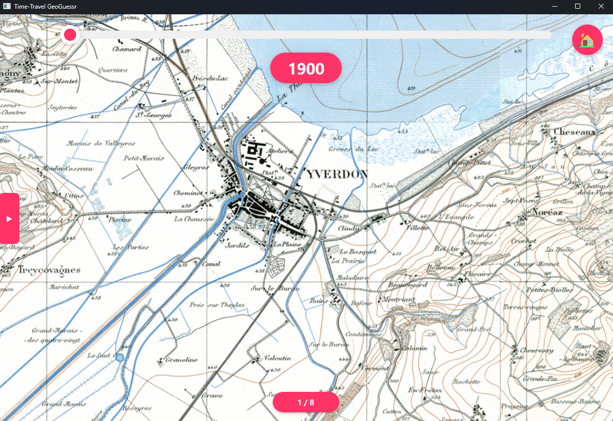
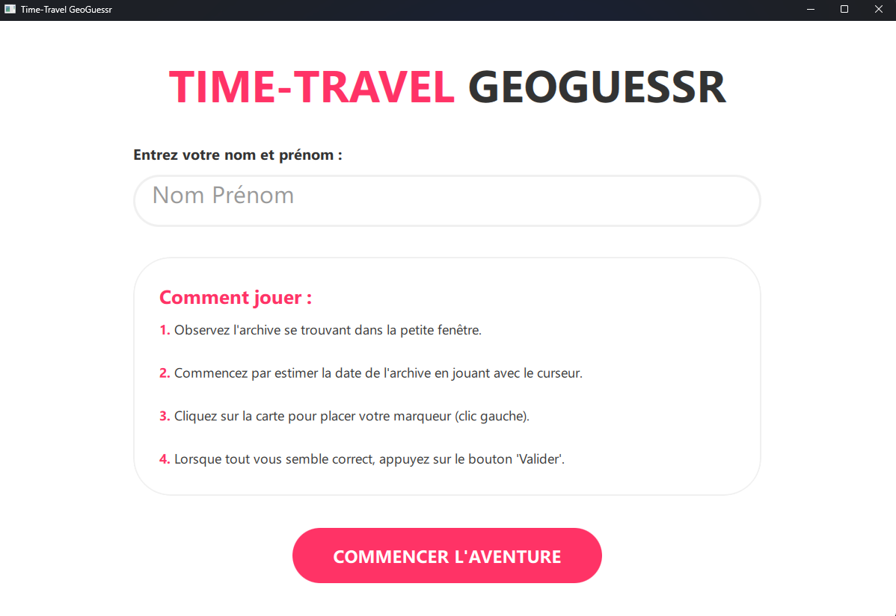
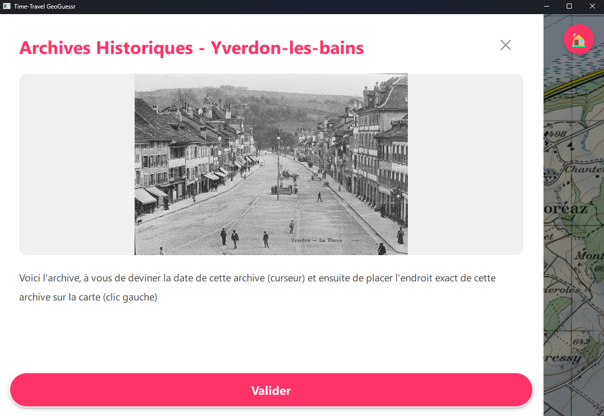
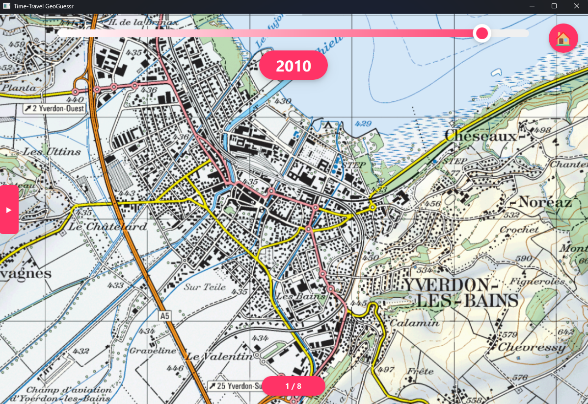
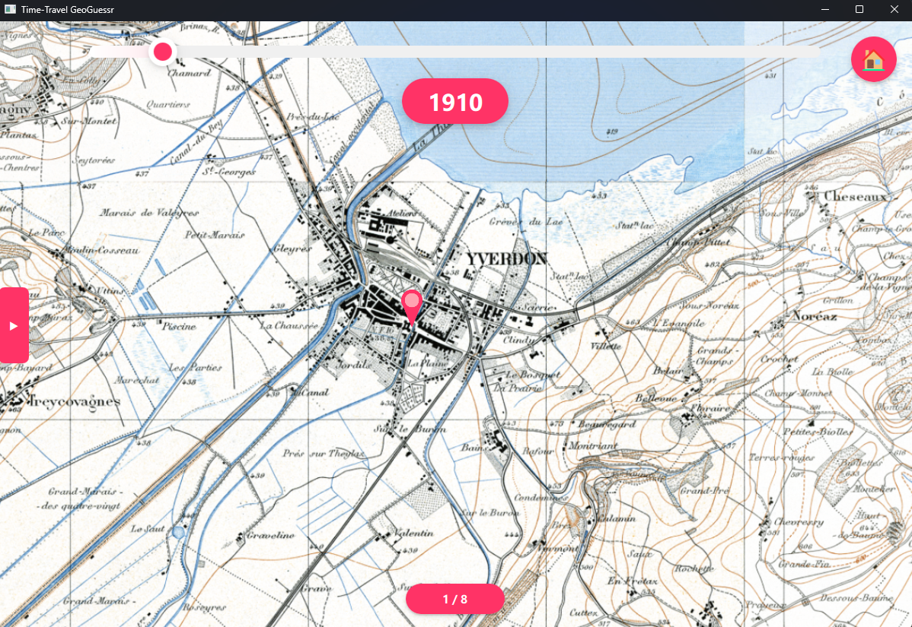
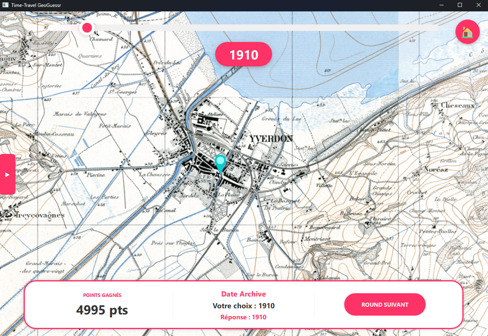
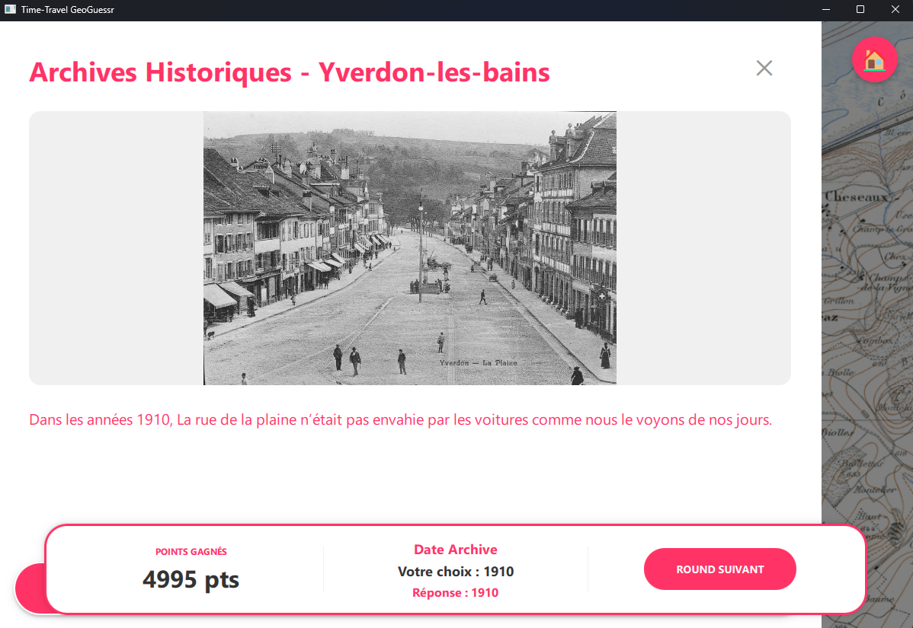

# Archives Guessr - RTS Archives

Ce projet a été réalisée lors du Crunch 2026 à l'HEIG-VD, pendant 1.5 jours. Cette application n'est pas complétement terminle, mais elle permet de donner un premier aperçu d'un jeu que l'équipe RTS Archives peut mettre en place afin d'enrichir la participation des spectateurs.

### Jeu

### Page d'acceuil

## Concept

Le jeu est basé sur [Geoguessr](https://www.geoguessr.com/fr) mais ajoute certains principes supplémentaires en lien avec les archives de la RTS :

1. Le joueur doit tout d'abord analyser l'archive, afin d'identifier la date de l'image.

2. Lorsque le joueur déplace le curseur, la carte en arrière plan change, selon l'année sélectionnée

3. Ensuite, lorsque la date est estimée, le joueur doit trouver l'emplacement approximatif de cette archive en plaçant un point sur la carte

4. Une fois l'endroit trouver, l'utilisateur fini par valider son tour de jeu.
5. Un score est ensuite calculé en fonction de la date sélectionnée et la position approximée.

6. Les réponses s'affichent à l'écran pour que l'utisateur puissent prendre connaissance de la date, d'une description et de l'emplacement de l'archive. 

## Utilisation de l'IA

Je tiens à préciser que pour réaliser ce projet, j'ai utilisé l'IA Gemini 3.1, afin de gagner du temps sur la conception de l'interface de l'application. Le code pourrait donc fortement être optimisé et revu.
